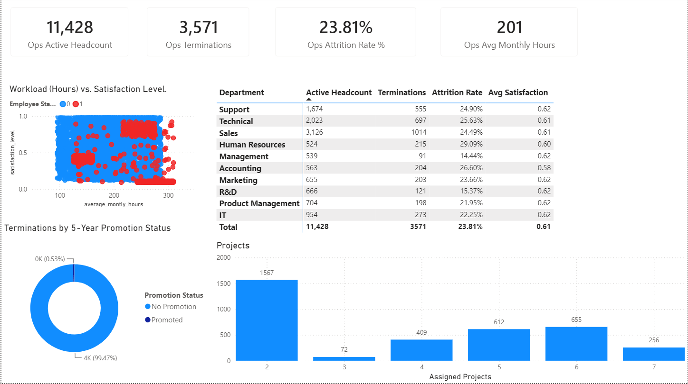
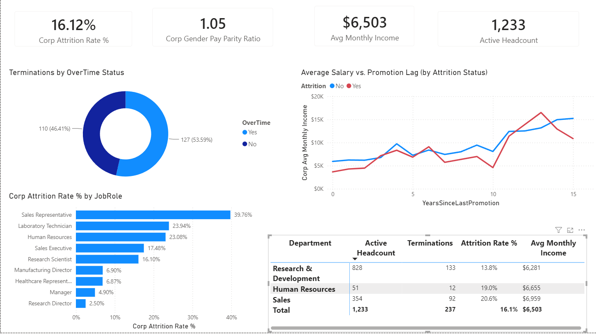
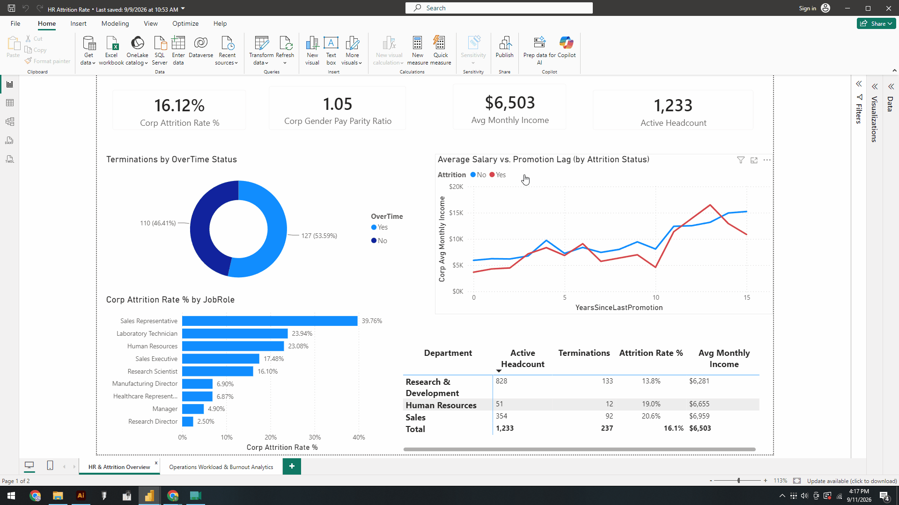
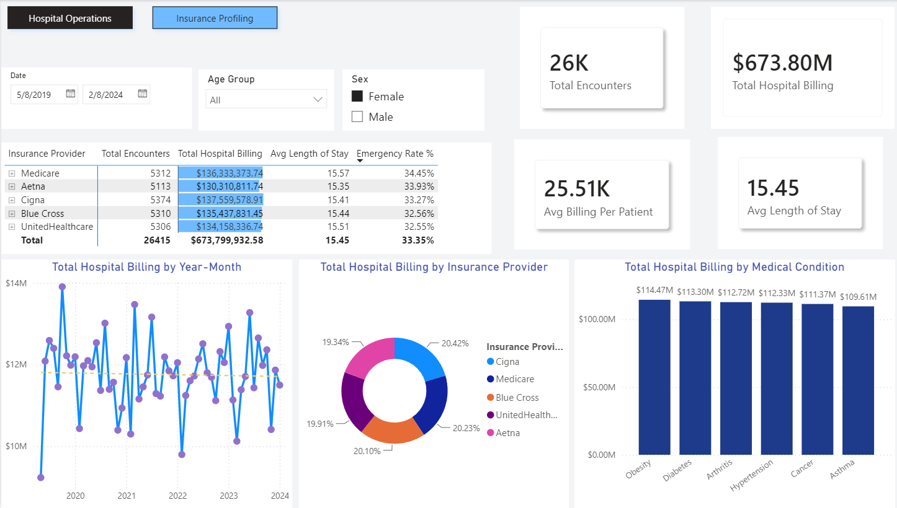
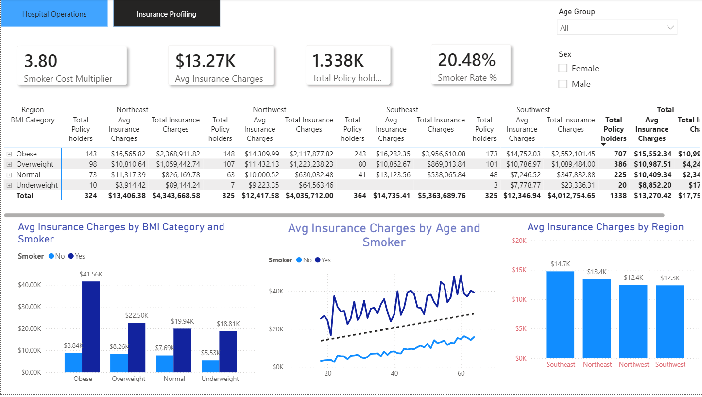
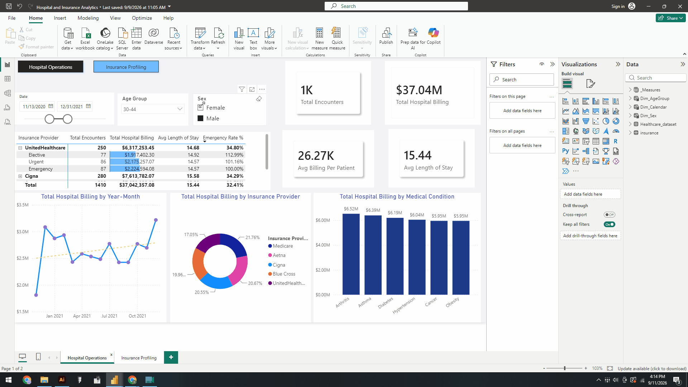
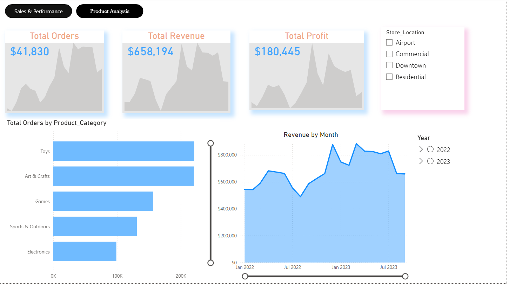
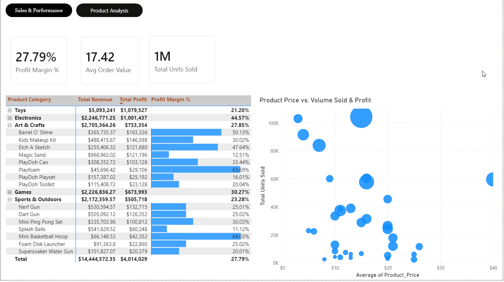
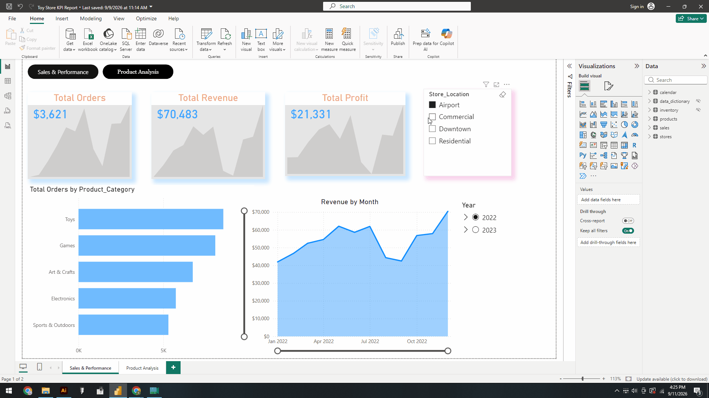

# Business Intelligence & Data Analytics Portfolio

A collection of end-to-end business intelligence case studies built using Microsoft Power BI, Power Query, DAX, SQL, and Python.
**Repository Structure**
```text
├── notebooks/
│   └── health_analysis.ipynb
├── sql/
│   ├── hospital_insurance.sql
│   ├── hr_attrition.sql
│   └── retail_kpi.sql
├── HR Attrition Rate.pbix
├── HR-Attrition-Demo.gif
├── HR-Attrition-Overview.png
├── HR-Operations-Workload.png
├── Hospital and Insurance Analytics.pbix
├── Hospital-Operations-Demo.gif
├── Hospital-Operations.png
├── Insurance-Profiling.png
├── Retail-KPI-Category.png
├── Retail-KPI-Demo.gif
├── Retail-KPI-Overview.png
└── Toy Store KPI Report.pbix
```
---

## Case Study 1: HR Attrition & Operations Analytics

### Business Question
Which departments and job roles are experiencing the highest rates of employee turnover, and how do workload factors—such as overtime, project load, and tenure—impact burnout and attrition risk?

### Approach
* Modeled employee demographic and operational data in **Power Query** to evaluate retention patterns across departments.
* Created dynamic **DAX measures** to calculate active headcount, overall attrition rate, average tenure, and overtime risk indicators.
* Designed an interactive matrix and visual slicers to isolate high-risk job roles and cross-filter turnover rates by workload intensity.

### Key Findings & Impact
* Overtime intensity proved to be the strongest predictor of voluntary turnover across engineering and sales roles.
* Mid-tenure employees (2–4 years) exhibited the highest attrition risk, indicating critical intervention points for career pathing and burnout management.
---
**Technical Artifacts & Code:**
* **SQL Data Transformations:** [`sql/hr_attrition.sql`](sql/hr_attrition.sql)
---



*Interactive walkthrough demonstrating dynamic cross-filtering and department slicers.*

---

## Case Study 2: Healthcare & Insurance Analytics

### Business Question
How do patient demographics, lifestyle factors (such as smoker status and BMI), and regional locations drive overall inpatient admission costs and insurance claim payouts?

### Approach
* Structured complex healthcare claims datasets into a clean star schema with normalized dimension tables.
* Authored DAX measures for average claim cost, patient risk scoring, and regional cost variance across hospital networks.
* Implemented cross-filtering visuals to segment patient cohorts based on age brackets, BMI risk categories, and coverage tiers.

### Key Findings & Impact
* Smoker status and high BMI had a compound effect on claim costs, driving average annual charges up to 3x higher than non-smoker baselines.
* Geographic analysis highlighted significant cost variance across regional networks, pointing to potential areas for provider rate renegotiations.
---
**Technical Artifacts & Code:**
* **SQL Queries & Benchmarks:** [`sql/hospital_insurance.sql`](sql/hospital_insurance.sql)
* **Python Exploratory Data Analysis:** [`notebooks/health_analysis.ipynb`](notebook/health_analysis.ipynb)
---



*Interactive walkthrough showing patient risk profiling and regional cost filters.*

---

## Case Study 3: Retail Performance & KPI Dashboard

### Business Question
What are the primary drivers of revenue growth across product categories, store locations, and sales channels, and which product lines yield the highest profit margins?

### Approach
* Engineered real-time sales performance indicators including total revenue, gross profit margin, average order value (AOV), and unit sales.
* Built dynamic time-intelligence measures in DAX for Year-Over-Year (YoY) revenue growth and Month-To-Date (MTD) tracking.
* Developed category-level drill-through capabilities to analyze stock movement, pricing sensitivity, and profitability by channel.

### Key Findings & Impact
* Top 20% of SKU offerings generated over 65% of total gross profit, identifying key inventory items to protect against supply disruptions.
* Strategic discounting in specific sub-categories increased total order volume without diluting overall net margins.
---
**Technical Artifacts & Code:**
* **SQL Aggregations & Joins:** [`sql/retail_kpi.sql`](sql/retail_kpi.sql)
---



*Interactive walkthrough displaying category drill-throughs and YoY time-intelligence views.*
